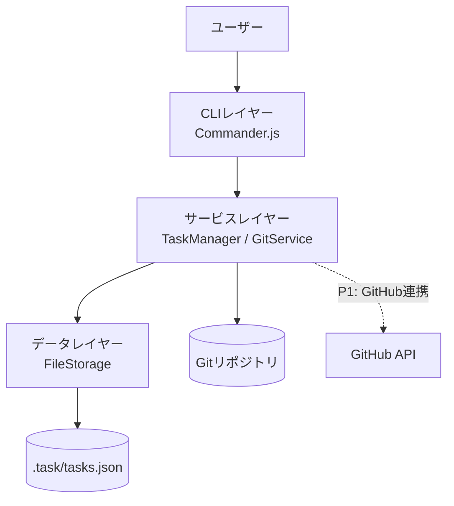
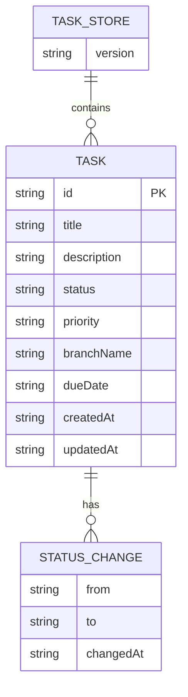
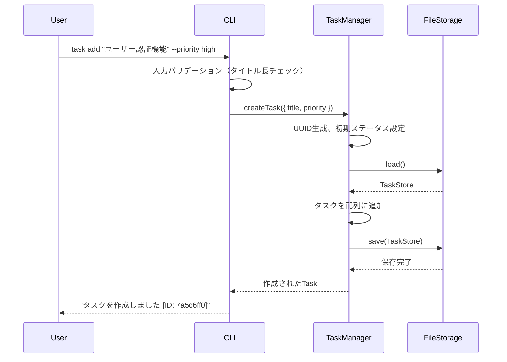
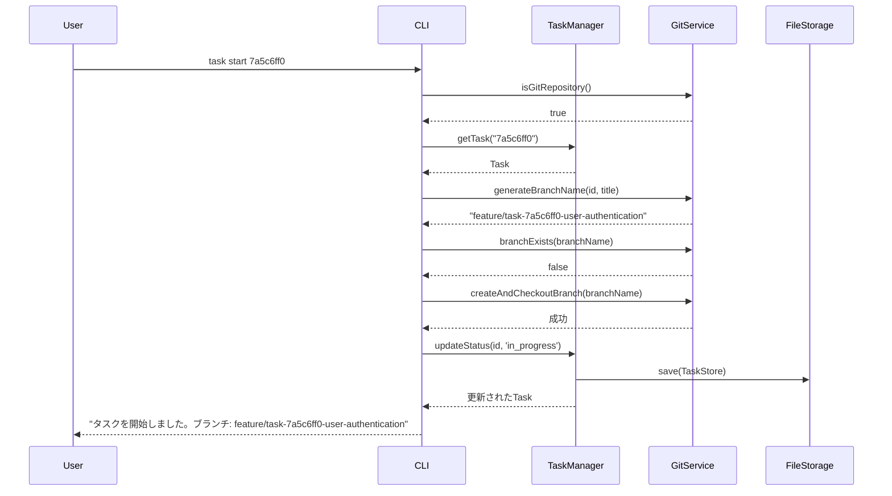
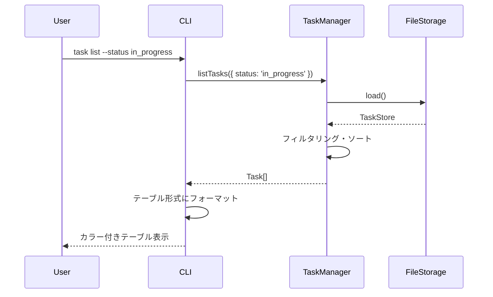
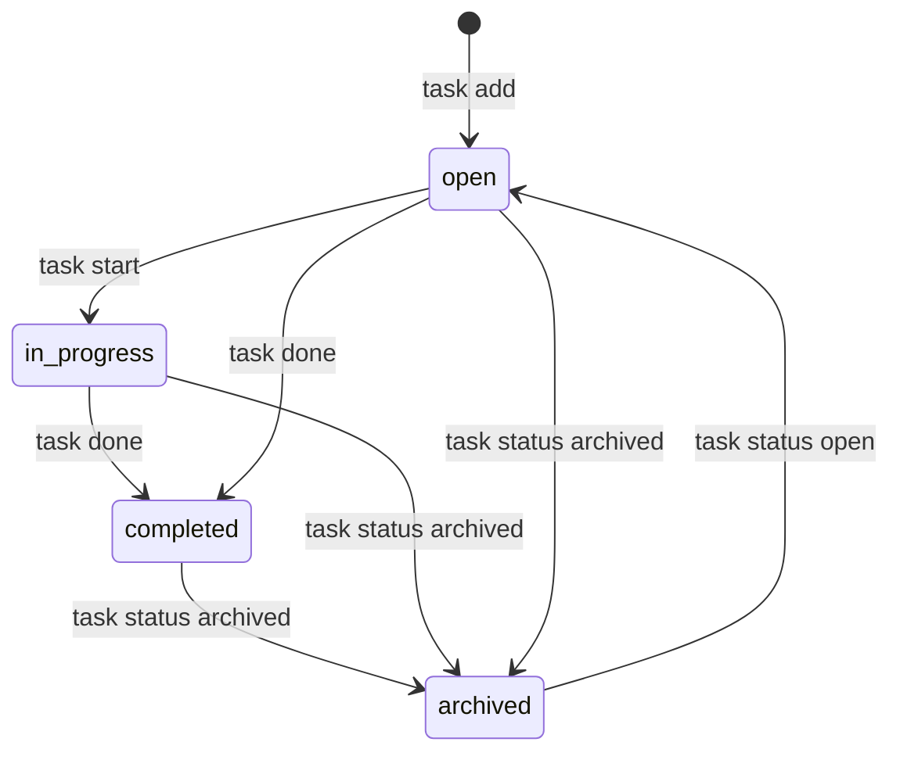

# 機能設計書 (Functional Design Document)

## システム構成図



## 技術スタック

| 分類 | 技術 | 選定理由 |
|------|------|----------|
| 言語 | TypeScript 5.x | 型安全性、Node.jsエコシステム、開発効率 |
| CLIフレームワーク | Commander.js | 学習コストが低い、機能が十分、実績あり |
| Git連携 | simple-git | Node.js向けGitライブラリ、APIが直感的 |
| データ保存 | JSON（ローカルファイル） | シンプル、Git管理可能、外部依存なし |
| テスト | Jest + ts-jest | TypeScriptとの相性、豊富なエコシステム |
| ビルド | tsc（TypeScript Compiler） | 追加ツール不要、シンプルな構成 |
| カラー出力 | chalk | ターミナルのカラー表示、軽量 |
| テーブル表示 | cli-table3 | テーブル形式のCLI出力に最適 |

---

## データモデル定義

### エンティティ: Task

```typescript
interface Task {
  id: string;                    // UUID v4（自動採番）
  title: string;                 // 1〜200文字
  description?: string;          // オプション（Markdown形式）
  status: TaskStatus;            // タスクの現在状態
  priority: TaskPriority;        // ユーザーが設定した優先度
  branchName?: string;           // 紐付いたGitブランチ名
  dueDate?: string;              // 期限（ISO 8601形式: YYYY-MM-DD）
  statusHistory: StatusChange[]; // ステータス変更履歴
  createdAt: string;             // 作成日時（ISO 8601形式）
  updatedAt: string;             // 最終更新日時（ISO 8601形式）
}

type TaskStatus = 'open' | 'in_progress' | 'completed' | 'archived';
type TaskPriority = 'high' | 'medium' | 'low';

interface StatusChange {
  from: TaskStatus;
  to: TaskStatus;
  changedAt: string;             // ISO 8601形式
}
```

**制約**:
- `id` はUUID v4形式。作成時に自動生成
- `title` は1文字以上200文字以下必須
- `status` のデフォルト値は `open`
- `priority` のデフォルト値は `medium`
- `statusHistory` は初期値として作成時のエントリを含む

### エンティティ: TaskStore（ファイル全体の構造）

```typescript
interface TaskStore {
  version: string;               // スキーマバージョン（例: "1.0.0"）
  tasks: Task[];                 // タスクの配列
}
```

### ER図



---

## コンポーネント設計

### CLIレイヤー（`src/cli/`）

**責務**:
- ユーザー入力の受付・パース
- 入力値のバリデーション
- サービスレイヤーへの処理委譲
- 実行結果・エラーのターミナル表示

**インターフェース**:
```typescript
// src/cli/index.ts - エントリポイント
function setupCLI(program: Command): void;

// src/cli/commands/*.ts - 各コマンドの定義
function registerAddCommand(program: Command, taskManager: TaskManager): void;
function registerListCommand(program: Command, taskManager: TaskManager): void;
function registerShowCommand(program: Command, taskManager: TaskManager): void;
function registerStartCommand(program: Command, taskManager: TaskManager, gitService: GitService): void;
function registerDoneCommand(program: Command, taskManager: TaskManager): void;
function registerDeleteCommand(program: Command, taskManager: TaskManager): void;
function registerStatusCommand(program: Command, taskManager: TaskManager): void;
function registerInitCommand(program: Command, fileStorage: FileStorage): void;
```

**依存関係**:
- Commander.js（CLIフレームワーク）
- chalk（カラー出力）
- cli-table3（テーブル表示）
- TaskManager、GitService（サービスレイヤー）

---

### サービスレイヤー: TaskManager（`src/services/TaskManager.ts`）

**責務**:
- タスクのCRUDビジネスロジック
- ステータス遷移の管理
- タスクIDの解決（部分一致対応）

**インターフェース**:
```typescript
class TaskManager {
  constructor(storage: FileStorage) {}

  // タスク作成
  createTask(data: CreateTaskInput): Task;

  // タスク一覧取得（フィルタ対応）
  listTasks(filter?: ListFilter): Task[];

  // タスク詳細取得
  getTask(id: string): Task;

  // タスクステータス更新
  updateStatus(id: string, status: TaskStatus): Task;

  // タスク削除
  deleteTask(id: string): void;

  // タスクを完了にする（done コマンド用）
  completeTask(id: string): Task;
}

interface CreateTaskInput {
  title: string;
  description?: string;
  priority?: TaskPriority;
  dueDate?: string;
}

interface ListFilter {
  status?: TaskStatus;
  priority?: TaskPriority;
  keyword?: string;            // 全文検索用
  sortBy?: 'priority' | 'dueDate' | 'createdAt';
}
```

**依存関係**:
- FileStorage（データレイヤー）
- uuid（UUID生成）

---

### サービスレイヤー: GitService（`src/services/GitService.ts`）

**責務**:
- Gitリポジトリの存在確認
- タスク開始時のブランチ自動作成・切り替え
- 現在のブランチ名取得

**インターフェース**:
```typescript
class GitService {
  // Gitリポジトリの存在確認
  isGitRepository(): Promise<boolean>;

  // タスク開始時のブランチ作成・切り替え
  createAndCheckoutBranch(branchName: string): Promise<void>;

  // ブランチ名の生成（タスクIDとタイトルから）
  generateBranchName(taskId: string, title: string): string;
  // 例: "feature/task-7a5c6ff0-user-authentication"

  // 現在のブランチ名取得
  getCurrentBranch(): Promise<string>;

  // ブランチの存在確認
  branchExists(branchName: string): Promise<boolean>;
}
```

**依存関係**:
- simple-git

---

### データレイヤー: FileStorage（`src/storage/FileStorage.ts`）

**責務**:
- `.task/tasks.json` の読み書き
- アトミックな書き込み（一時ファイル経由）
- 自動バックアップ

**インターフェース**:
```typescript
class FileStorage {
  constructor(basePath: string) {}  // デフォルト: process.cwd()

  // データ読み込み
  load(): TaskStore;

  // データ書き込み（アトミック）
  save(store: TaskStore): void;

  // 初期化（.task/ディレクトリとtasks.jsonの作成）
  initialize(): void;

  // 初期化済みか確認
  isInitialized(): boolean;

  // バックアップ作成
  createBackup(): string;   // バックアップファイルパスを返す
}
```

**依存関係**:
- Node.js fs（ファイルシステム）

---

## ユースケース図

### UC1: タスク作成（`task add`）



### UC2: タスク開始（`task start`）



### UC3: タスク一覧表示（`task list`）



---

## タスクステータス遷移図



---

## UI設計

### タスク一覧表示（`task list`）

```
ID        タイトル                       ステータス    優先度   期限
────────  ─────────────────────────────  ──────────   ──────   ──────────
7a5c6ff0  ユーザー認証機能の実装           進行中       高       2026-03-15
b2d4e891  データエクスポート機能            未着手       中       -
f1a3c728  初期セットアップ                 完了         低       -
```

### カラーコーディング

**ステータスの色分け**:
- `completed`（完了）: 緑
- `in_progress`（進行中）: 黄
- `open`（未着手）: 白
- `archived`（アーカイブ）: グレー

**優先度の色分け**:
- `high`（高）: 赤
- `medium`（中）: 黄
- `low`（低）: 青

**期限の色分け**:
- 期限超過: 赤（太字）
- 3日以内: 黄
- それ以外: 白

### タスク詳細表示（`task show`）

```
タスク詳細
──────────────────────────────────────
ID:         7a5c6ff0-5f55-474e-baf7-...
タイトル:   ユーザー認証機能の実装
ステータス: 進行中
優先度:     高
ブランチ:   feature/task-7a5c6ff0-user-authentication
期限:       2026-03-15
作成日時:   2026-03-01 10:00
更新日時:   2026-03-02 14:30

ステータス履歴:
  2026-03-01 10:00  open → in_progress
```

---

## ファイル構造

**データ保存ディレクトリ**:
```
.task/
├── tasks.json       # タスクデータ（メイン）
├── config.json      # 設定データ（GitHubトークン等）
└── backup/
    └── tasks.json.2026-03-08T10-00-00.bak  # バックアップ
```

**`tasks.json` の形式**:
```json
{
  "version": "1.0.0",
  "tasks": [
    {
      "id": "7a5c6ff0-5f55-474e-baf7-ea13624d73a4",
      "title": "ユーザー認証機能の実装",
      "description": "",
      "status": "in_progress",
      "priority": "high",
      "branchName": "feature/task-7a5c6ff0-user-authentication",
      "dueDate": "2026-03-15",
      "statusHistory": [
        {
          "from": "open",
          "to": "in_progress",
          "changedAt": "2026-03-02T14:30:00.000Z"
        }
      ],
      "createdAt": "2026-03-01T10:00:00.000Z",
      "updatedAt": "2026-03-02T14:30:00.000Z"
    }
  ]
}
```

**`config.json` の形式**:
```json
{
  "github": {
    "token": "",
    "owner": "",
    "repo": ""
  }
}
```

---

## パフォーマンス最適化

- **同期ファイル読み書き**: CLIツールの即時応答のため、fs.readFileSyncを使用（非同期でのオーバーヘッドを回避）
- **メモリ上でのフィルタリング**: JSONを1回読み込んでメモリ上でフィルタ・ソートを実施（1万件まで対応）
- **アトミック書き込み**: 一時ファイル（`.task/tasks.json.tmp`）に書き込み後、リネームで置き換える

---

## セキュリティ考慮事項

- **GitHubトークン管理**: `.task/config.json` はパーミッション `600` で保存。デフォルトで `.gitignore` に追加
- **入力バリデーション**: タイトルの文字数チェック（1〜200文字）、ステータス値の列挙型チェック
- **コマンドインジェクション防止**: `simple-git` ライブラリ経由でGitコマンドを実行し、シェルインジェクションを防ぐ

---

## エラーハンドリング

### エラーの分類

| エラー種別 | 処理 | ユーザーへの表示 |
|-----------|------|-----------------|
| 未初期化エラー | 処理中断 | `エラー: TaskCLIが初期化されていません。"task init" を実行してください` |
| タスク未存在 | 処理中断 | `エラー: タスクが見つかりません (ID: xxx)` |
| 入力バリデーション | 処理中断 | `エラー: タイトルは1〜200文字で入力してください` |
| Gitリポジトリ未検出 | 処理中断 | `エラー: Gitリポジトリが見つかりません。Gitリポジトリ内で実行してください` |
| ブランチ名衝突 | ユーザー確認 | `ブランチ "xxx" は既に存在します。続行しますか? [y/N]` |
| ファイル書き込みエラー | 処理中断＋バックアップ保持 | `エラー: データの保存に失敗しました。バックアップ: .task/backup/...` |
| JSON破損 | 処理中断 | `エラー: データファイルが破損しています。バックアップから復元してください` |

### エラー終了コード

| コード | 意味 |
|--------|------|
| 0 | 正常終了 |
| 1 | 一般エラー（入力エラー、タスク未存在等） |
| 2 | システムエラー（ファイルI/Oエラー等） |

---

## テスト戦略

### ユニットテスト（`src/**/*.test.ts`）

- `TaskManager`: CRUD操作、ステータス遷移、フィルタリングロジック
- `FileStorage`: 読み書き、バックアップ作成、アトミック書き込み
- `GitService`: ブランチ名生成ロジック（`generateBranchName`）

### 統合テスト（`tests/integration/`）

- `task init` → `task add` → `task start` → `task done` のフルフロー
- フィルタオプション付き `task list` の動作確認
- ファイル破損時のエラーハンドリング

### E2Eテスト（`tests/e2e/`）

- 実際のCLIコマンドをexec経由で実行し、出力と終了コードを検証
- Gitリポジトリがない環境での `task start` エラー確認
- 1000件のタスクを登録した際の `task list` 応答時間（1秒以内）
