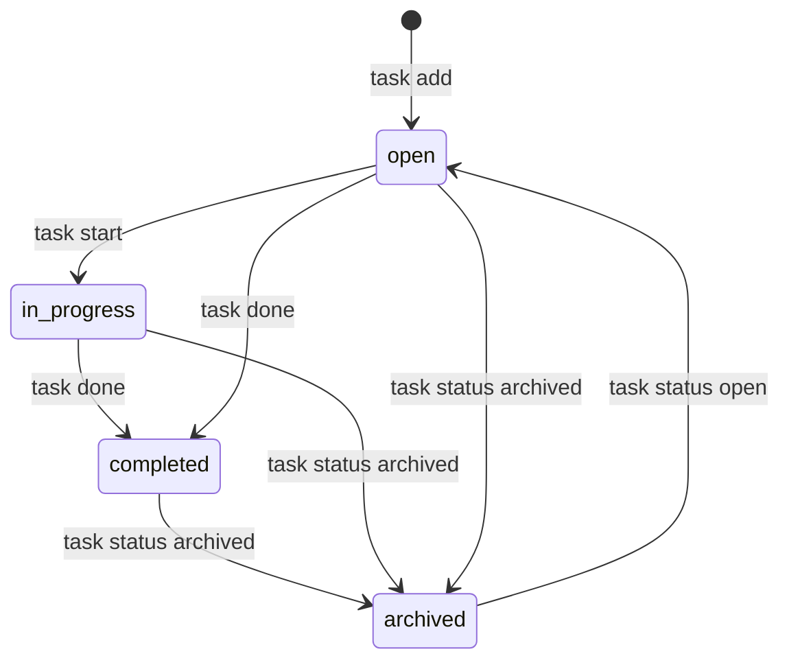

# プロジェクト用語集 (Glossary)

## 概要

このドキュメントは、TaskCLIプロジェクト内で使用される用語の定義を管理します。

**更新日**: 2026-03-08

---

## ドメイン用語

プロジェクト固有のビジネス概念や機能に関する用語。

### タスク

**定義**: TaskCLIで管理する作業の最小単位

**説明**: 開発者が行う作業を表すデータ。タイトル・ステータス・優先度・期限などのメタデータを持ち、Gitブランチと1対1で紐付けることができる。

**関連用語**: タスクステータス、タスク優先度、ブランチ名

**使用例**:
- `task add "ユーザー認証機能の実装"` でタスクを作成する
- タスクをGitブランチと紐付けて管理する

**英語表記**: Task

---

### タスクステータス

**定義**: タスクの現在の進捗状態を表す4段階の値

**説明**: タスクのライフサイクルを管理するためのステータス。`open`（新規）→`in_progress`（作業中）→`completed`（完了）→`archived`（アーカイブ）の順に遷移する。

**関連用語**: タスク、ステータス遷移

**使用例**:
- `task start 1` でステータスが `open` → `in_progress` に変わる
- `task done 1` でステータスが `in_progress` → `completed` に変わる

**英語表記**: Task Status

---

### タスク優先度

**定義**: タスクの重要度・緊急度を示す3段階の値

**説明**: ユーザーが手動で設定するタスクの優先度。`high`（高）・`medium`（中）・`low`（低）の3段階。デフォルト値は `medium`。`task list` での表示に色分けが反映される。

**関連用語**: タスク

**使用例**:
- `task add "緊急バグ修正" --priority high`

**英語表記**: Task Priority

---

### ブランチ名（自動生成）

**定義**: TaskCLIがタスク開始時に自動生成するGitブランチ名

**説明**: `task start <id>` 実行時に `feature/task-<id短縮形>-<タイトルのスラッグ>` 形式で自動生成される。タスクとGitブランチの1対1対応を保証するための命名規則。

**関連用語**: タスク、Gitブランチ

**使用例**:
- タスクID `7a5c6ff0`、タイトル「ユーザー認証機能の実装」の場合:
  → `feature/task-7a5c6ff0-user-authentication`

**英語表記**: Auto-generated Branch Name

---

### ステータス履歴

**定義**: タスクのステータス変更の記録

**説明**: タスクがいつ、どのステータスから何に変わったかを時系列で記録するデータ。`task show <id>` コマンドで確認できる。

**関連用語**: タスクステータス、タスク

**使用例**:
- `task show 1` の出力に「2026-03-01 → open: in_progress」として表示される

**英語表記**: Status History

---

### タスクストア

**定義**: `.task/tasks.json` ファイルに保存されるタスクデータの全体構造

**説明**: スキーマバージョンとタスク配列から構成されるJSONオブジェクト。`FileStorage` クラスがこのデータを読み書きする。

**関連用語**: FileStorage、タスク

**英語表記**: Task Store

---

### コンテキストスイッチ

**定義**: 開発作業中にターミナルとGUIツールを行き来することによる集中力の分断

**説明**: TaskCLIが解決を目指す主要な課題。ターミナルでコードを書きながら、タスク管理のためにブラウザやGUIアプリに切り替える行為が開発効率を下げる。

**関連用語**: なし

**英語表記**: Context Switch

---

## 技術用語

プロジェクトで使用している技術・フレームワーク・ツールに関する用語。

### Commander.js

**定義**: Node.js向けのCLIフレームワーク

**本プロジェクトでの用途**: CLIコマンドの定義・パース・ヘルプ生成に使用。`src/cli/index.ts` でセットアップし、各コマンドを `src/cli/commands/` に定義する。

**バージョン**: ^12.x

**関連ドキュメント**: `docs/architecture.md`

---

### simple-git

**定義**: Node.js向けのGit操作ライブラリ

**本プロジェクトでの用途**: `GitService` クラス内でGitリポジトリの操作（ブランチ作成・切り替え・現在ブランチ取得）に使用。シェルコマンドの直接実行を避け、コマンドインジェクションを防ぐ。

**バージョン**: ^3.x

**関連ドキュメント**: `docs/architecture.md`, `docs/functional-design.md`

---

### アトミック書き込み

**定義**: ファイル書き込みを中断されてもデータが破損しない書き込み方式

**本プロジェクトでの用途**: `FileStorage.save()` で採用。一時ファイル（`.task/tasks.json.tmp`）に書き込んだ後、`fs.renameSync()` でリネームすることでOSレベルのアトミック操作を実現する。

**バージョン**: Node.js標準機能

**関連ドキュメント**: `docs/functional-design.md`

---

### UUID v4

**定義**: ランダムに生成される128ビットの一意識別子

**本プロジェクトでの用途**: タスクIDの生成に使用。`xxxxxxxx-xxxx-4xxx-yxxx-xxxxxxxxxxxx` 形式（例: `7a5c6ff0-5f55-474e-baf7-ea13624d73a4`）。`uuid` パッケージの `uuidv4()` 関数で生成。

**バージョン**: uuidパッケージ ^9.x

**関連ドキュメント**: `docs/functional-design.md`

---

## 略語・頭字語

### CLI

**正式名称**: Command Line Interface

**意味**: コマンドラインからテキストコマンドで操作するインターフェース

**本プロジェクトでの使用**: TaskCLI本体の操作形式。ターミナルから `task` コマンドで全操作を行う。

---

### CRUD

**正式名称**: Create, Read, Update, Delete

**意味**: データの基本操作4種類（作成・読み取り・更新・削除）

**本プロジェクトでの使用**: `TaskManager` クラスがタスクのCRUD操作を提供する。

---

### PRD

**正式名称**: Product Requirements Document

**意味**: プロダクト要求定義書。プロダクトの目的・ターゲットユーザー・機能要件を定義するドキュメント。

**本プロジェクトでの使用**: `docs/product-requirements.md`

---

### MVP

**正式名称**: Minimum Viable Product

**意味**: 最小限の機能で市場に投入できるプロダクト

**本プロジェクトでの使用**: P0優先度の機能（タスクCRUD・ステータス管理・Gitブランチ自動連携・ローカルJSONストレージ）がMVPに相当する。

---

### NPS

**正式名称**: Net Promoter Score

**意味**: 顧客がプロダクトを他者に推奨する可能性を測定するスコア。-100〜100の範囲。

**本プロジェクトでの使用**: 成功指標（KPI）の一つとして設定。目標は30以上（`docs/product-requirements.md`）。

---

## アーキテクチャ用語

### レイヤードアーキテクチャ

**定義**: システムをCLI・サービス・データの3つのレイヤーに分離する設計パターン

**本プロジェクトでの適用**: 上位レイヤーのみが下位レイヤーに依存し、逆方向の依存を禁止する。CLIレイヤー → サービスレイヤー → データレイヤーの順で依存する。

**関連コンポーネント**: `src/cli/`（CLIレイヤー）、`src/services/`（サービスレイヤー）、`src/storage/`（データレイヤー）

**図解**:
```
CLIレイヤー（src/cli/）
    ↓ 依存
サービスレイヤー（src/services/）
    ↓ 依存
データレイヤー（src/storage/）
```

---

### TaskManager

**定義**: タスクのCRUDビジネスロジックを担うサービスクラス

**本プロジェクトでの適用**: サービスレイヤーに属する。`FileStorage` に依存してデータを永続化する。CLIコマンドから呼び出される。

**関連コンポーネント**: `src/services/TaskManager.ts`

---

### GitService

**定義**: Gitリポジトリ操作を担うサービスクラス

**本プロジェクトでの適用**: サービスレイヤーに属する。`simple-git` ライブラリを使用してブランチの作成・切り替えを行う。`task start` コマンドから呼び出される。

**関連コンポーネント**: `src/services/GitService.ts`

---

### FileStorage

**定義**: `.task/tasks.json` へのJSONデータ読み書きを担うクラス

**本プロジェクトでの適用**: データレイヤーに属する。アトミック書き込みと自動バックアップを提供する。`TaskManager` から利用される。

**関連コンポーネント**: `src/storage/FileStorage.ts`

---

## ステータス・状態

### タスクステータス一覧

| ステータス | 日本語 | 意味 | 遷移条件 | 次の状態 |
|----------|--------|------|---------|---------|
| `open` | 未着手 | 作成直後の初期状態 | `task add` で作成時 | `in_progress`, `completed`, `archived` |
| `in_progress` | 作業中 | Gitブランチで作業中 | `task start <id>` 実行時 | `completed`, `archived` |
| `completed` | 完了 | 作業が完了した状態 | `task done <id>` 実行時 | `archived` |
| `archived` | アーカイブ | 非表示にした状態 | `task status <id> archived` 実行時 | `open`（手動で戻せる） |

**状態遷移図**:


---

## データモデル用語

### Task（タスクエンティティ）

**定義**: システムで管理するタスクのデータ構造

**主要フィールド**:
- `id`: UUID v4形式の一意識別子
- `title`: タスクのタイトル（1〜200文字）
- `status`: 現在のステータス（`TaskStatus`型）
- `priority`: 優先度（`TaskPriority`型）
- `branchName`: 紐付いたGitブランチ名（オプション）
- `dueDate`: 期限（YYYY-MM-DD形式、オプション）
- `statusHistory`: ステータス変更履歴の配列
- `createdAt`: 作成日時（ISO 8601形式）
- `updatedAt`: 最終更新日時（ISO 8601形式）

**関連エンティティ**: `StatusChange`（ステータス変更履歴）

**制約**: `title` は必須（1〜200文字）、`id` はシステム自動生成

---

### StatusChange（ステータス変更履歴）

**定義**: タスクのステータス変更1件を記録するデータ構造

**主要フィールド**:
- `from`: 変更前のステータス
- `to`: 変更後のステータス
- `changedAt`: 変更日時（ISO 8601形式）

**関連エンティティ**: `Task`（親エンティティ）

---

## エラー・例外

### TaskCLIError

**クラス名**: `TaskCLIError`

**発生条件**: TaskCLI全般のエラー基底クラス。直接スローすることは少なく、サブクラスを使用する。

**対処方法**: エラーメッセージを確認し、コマンドのヘルプ（`task --help`）を参照する。

**エラーコード**: 1（一般エラー）

---

### TaskNotFoundError

**クラス名**: `TaskNotFoundError`

**発生条件**: 指定したIDのタスクが `.task/tasks.json` に存在しない場合

**対処方法**: `task list` で存在するタスクIDを確認してから再実行する。

**エラーコード**: 1

**例**:
```
エラー: タスクが見つかりません (ID: 7a5c6ff0)
```

---

### ValidationError

**クラス名**: `ValidationError`

**発生条件**: ユーザーの入力値が不正な場合（タイトルが空、ステータス値が無効等）

**対処方法**: エラーメッセージに従って入力値を修正する。

**エラーコード**: 1

**例**:
```
エラー: タイトルは1〜200文字で入力してください
```

---

### GitError

**クラス名**: `GitError`

**発生条件**: Gitリポジトリが存在しない環境で `task start` を実行した場合、またはGitコマンドが失敗した場合

**対処方法**: Gitリポジトリのルートディレクトリで実行しているか確認する。

**エラーコード**: 2（システムエラー）

**例**:
```
エラー: Gitリポジトリが見つかりません。Gitリポジトリ内で実行してください
```
